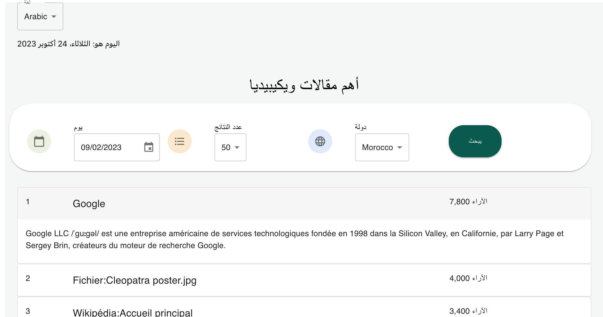
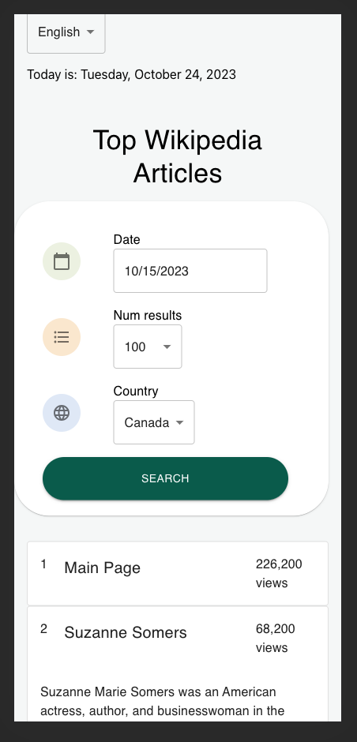
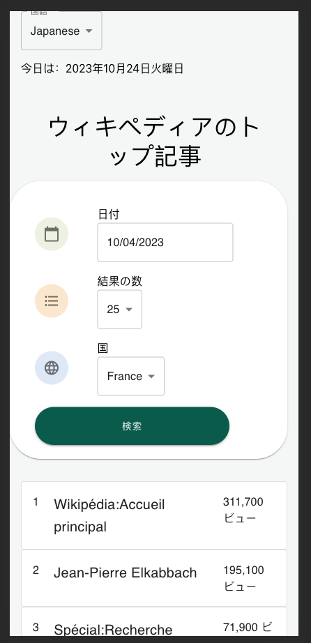

# Grow Therapy Take Home Assessment 

This project was bootstrapped with [Create React App](https://github.com/facebook/create-react-app).

## Primary Features
This project uses the public Wikipedia API to display the top Wikipedia articles based on search filters. The 2 filters available are - date and country.

A user can select an available day in the past (starting from yesterday) and display the top Wikipedia articles for that day. The articles are displayed in a list, initially with the rank, title, and number of views in the header. When the user clicks on the article header, if the summary of the article is available the entry will be expanded to include that additional summary detail of the article.

The user can also filter by the list of available countries. The available country list is a semi random list of countries available in the API, with opportunity for expansion. The user can further choose to display a set number of results.

Additionally, this project has been internationalized and translated (using Google Translate) to include a short list of locales. The user can change the project's display language. This internationalization and localization has been included for each string, date, and number formatted to the user based on the locale selection.

## Screenshots

## Opportunities for further development

With more time, further development would be invested in improving the testing, error handling, style, and overall production ready performance of the project. Particularly setting up the ideal test environment would require a manual override of the "create-react-app" jest suite to instead include enzyme for shallow rendering of components, due to the react-intl IntlProviderContext at the high level root of the project.

The current style, look, and feel of the project are nearly all powered by material design. With more time, adding a custom theme based on the desired design specs would be required. This theme would include the correct font, typography, color, spacing, button radius, and all other design customizations. Additionally significant improvements could be made to the responsiveness of the layout and further additions to the sizing breakpoints and mobile, tablet, desktop specific differences.

## Available Scripts

In the project directory, you can run:

### `npm start`

Runs the app in the development mode.\
Open [http://localhost:3000](http://localhost:3000) to view it in your browser.

The page will reload when you make changes.\
You may also see any lint errors in the console.

### `npm test`

Launches the test runner in the interactive watch mode.\
See the section about [running tests](https://facebook.github.io/create-react-app/docs/running-tests) for more information.

### `npm run build`

Builds the app for production to the `build` folder.\
It correctly bundles React in production mode and optimizes the build for the best performance.

The build is minified and the filenames include the hashes.\
Your app is ready to be deployed!

See the section about [deployment](https://facebook.github.io/create-react-app/docs/deployment) for more information.

